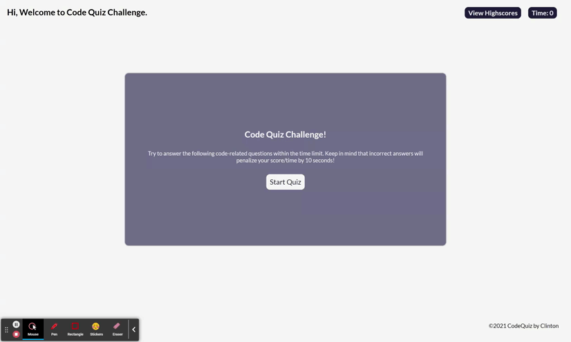

# Code Quiz Challenge
This is the code quiz challenge assignment

## User Story
User wants to take a timed quiz on JavaScript fundamentals that stores high scores so that the user can gauge my progress compared to peers.

## Languages
- HTML
- CSS
- Javascript

## Acceptance Criteria
- When the user clicks the button, a timer starts and user presented with a question.
- When user answer the question, the user presented with another question.
- If the user answer a question incorrectly, time is subtracted from the clock.
- When all questions are answered or the timer reaches 0, the game is over.
- When the game is over, user can save my initials and score.

## Final Product Link
[**Click Here**](https://pravton.github.io/code-quiz-challenge/) to view the project in Github Pages.

## Mockup

## Final Output
>### NOTE
>The UI has been modified but the functionalities are same. 

